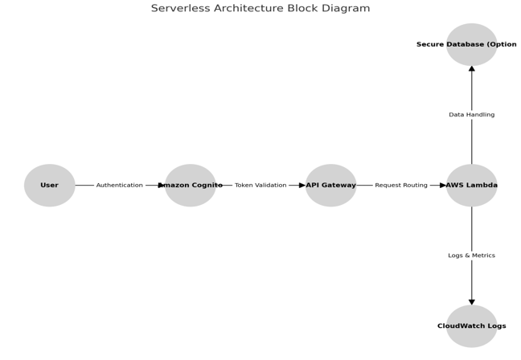
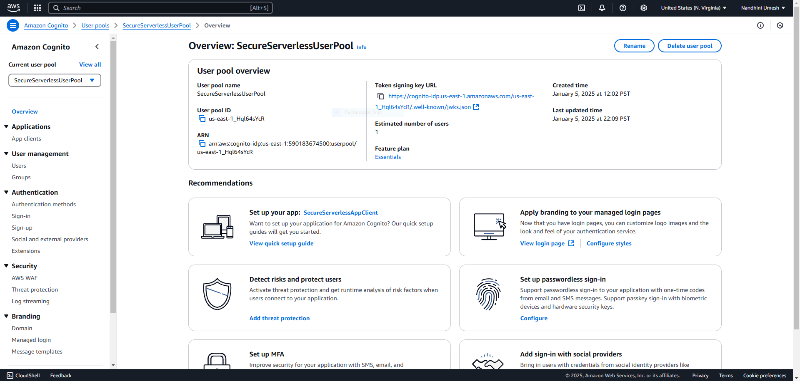
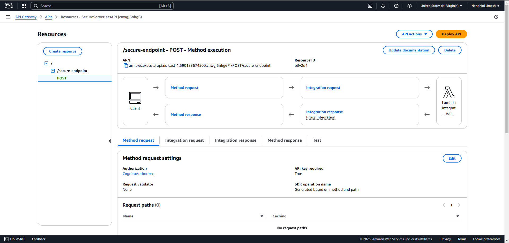
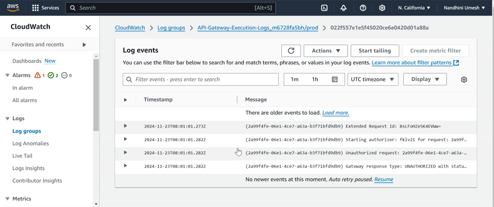

# Secure Serverless API on AWS

This project demonstrates the implementation of a secure serverless API using AWS Lambda, API Gateway, and Amazon Cognito, with robust security measures to mitigate common threats.

## Features
- **Authentication**: Configured Amazon Cognito for user authentication and JWT token validation.
- **Input Validation**: Validates and sanitizes user inputs to prevent XSS and other injection attacks.
- **Rate Limiting**: Implemented usage plans and throttling in API Gateway to prevent DoS attacks.
- **Threat Mitigation**: Used AWS WAF to block SQL injection and other web attacks.
- **Monitoring**: Configured CloudWatch for logging and anomaly detection.

## Architecture

## AWS Services Used
- **Lambda**: For serverless backend logic.
- **API Gateway**: To expose RESTful APIs.
- **Cognito**: For user authentication and authorization.
- **WAF**: For protecting APIs from web-based threats.
- **CloudWatch**: For monitoring and logging.

## How It Works
1. Users authenticate through Amazon Cognito and receive a JWT token.
2. API Gateway validates the token and forwards the request to Lambda.
3. Lambda processes the request and logs activity in CloudWatch.
4. WAF inspects requests to block malicious traffic.

## Screenshots
### Cognito Configuration

### API Gateway Method Configuration

### CloudWatch Logs

## Challenges and Resolutions
- **IAM Permissions**: Resolved unauthorized errors by refining IAM roles with the least privilege.
- **API Key Misconfigurations**: Correctly associated API keys with usage plans in API Gateway.

## Lessons Learned
- Implementing robust security in serverless architectures.
- Using AWS services effectively for scalability and security.

## License
- This project is licensed under the [MIT License](License). You are free to use, modify, and distribute this project, provided that you include the original license text in any copies or substantial portions of the software.

